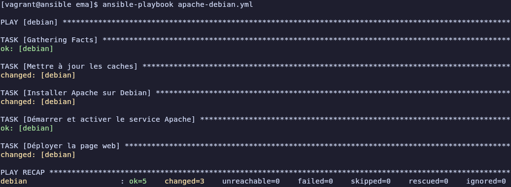
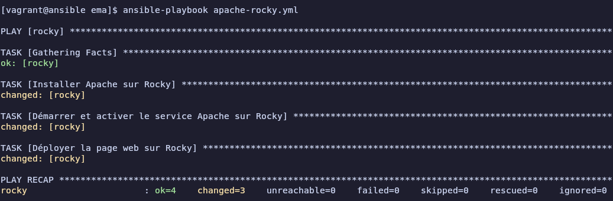
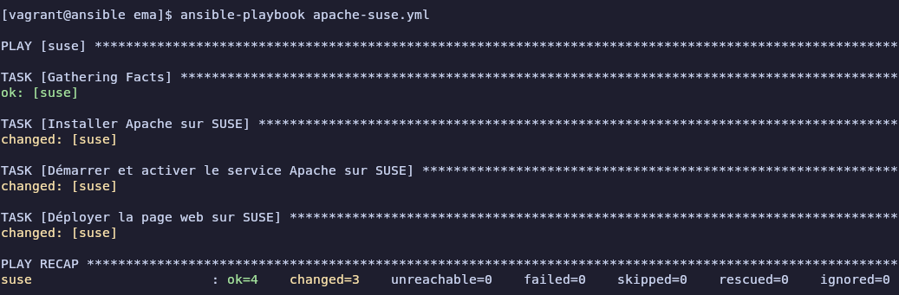
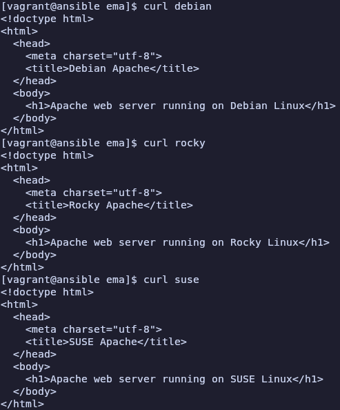

# Atelier 10

## Exercice 1 : 

1. **Démarrer les VMs**  
```bash
cd ~/formation-ansible/atelier-10
vagrant up
```

2. **Connexion au Control Host**
```bash
vagrant ssh ansible
```

3. **Se rendre dans le repertoire du projet**
```bash
cd ansible/projets/ema/
```

4. **Créer un playbook `apache-debian.yml`**
```yml
---  # Apache sur l’hôte Debian
- hosts: debian
  tasks:
    - name: Mettre à jour les caches
      apt:
        update_cache: true
        cache_valid_time: 3600

    - name: Installer Apache sur Debian
      apt:
        name: apache2
        state: present

    - name: Démarrer et activer le service Apache sur Debian
      service:
        name: apache2
        state: started
        enabled: true

    - name: Déployer la page web sur Debian
      copy:
        dest: /var/www/html/index.html
        mode: 0644
        content: |
          <!doctype html>
          <html>
            <head>
              <meta charset="utf-8">
              <title>Debian Apache</title>
            </head>
            <body>
              <h1>Apache web server running on Debian Linux</h1>
            </body>
          </html>
```

5. **Vérifier la syntaxe du fichier `apache-debian.yml`**
```bash
yamllint apache-debian.yml
```
Aucune sortie, le fichier `apache-debian.yml` est correct

6. **Créer un playbook `apache-rocky.yml`**
```yml
---  # Apache sur l’hôte Rocky
- hosts: rocky
  tasks:
    - name: Installer Apache sur Rocky
      dnf:
        name: httpd
        state: present

    - name: Démarrer et activer le service Apache sur Rocky
      service:
        name: httpd
        state: started
        enabled: true

    - name: Déployer la page web sur Rocky
      copy:
        dest: /var/www/html/index.html
        mode: 0644
        content: |
          <!doctype html>
          <html>
            <head>
              <meta charset="utf-8">
              <title>Rocky Apache</title>
            </head>
            <body>
              <h1>Apache web server running on Rocky Linux</h1>
            </body>
          </html>
```

7. **Vérifier la syntaxe du fichier `apache-rocky.yml`**
```bash
yamllint apache-rocky.yml
```
Aucune sortie, le fichier `apache-rocky.yml` est correct

8. **Créer un playbook `apache-suse.yml`**
```yml
---  # Apache sur l’hôte SUSE
- hosts: suse
  tasks:
    - name: Installer Apache sur SUSE
      zypper:
        name: apache2
        state: present

    - name: Démarrer et activer le service Apache sur SUSE
      service:
        name: apache2
        state: started
        enabled: true

    - name: Déployer la page web sur SUSE
      copy:
        dest: /srv/www/htdocs/index.html
        mode: 0644
        content: |
          <!doctype html>
          <html>
            <head>
              <meta charset="utf-8">
              <title>SUSE Apache</title>
            </head>
            <body>
              <h1>Apache web server running on SUSE Linux</h1>
            </body>
          </html>
```

9. **Vérifier la syntaxe du fichier `apache-suse.yml`**
```bash
yamllint apache-suse.yml
```
Aucune sortie, le fichier `apache-suse.yml` est correct

10. **Tester la connectivité**
```bash
ansible debian -m ping
debian | SUCCESS => {
    "changed": false,
    "ping": "pong"
}

ansible rocky -m ping
rocky | SUCCESS => {
    "changed": false,
    "ping": "pong"
}

ansible suse -m ping
suse | SUCCESS => {
    "changed": false,
    "ping": "pong"
}
```

11. **Exécuter le playbook `apache-debian.yml`**

```bash
ansible-playbook apache-debian.yml
```


12. **Exécuter le playbook `apache-rocky.yml`**

```bash
ansible-playbook apache-rocky.yml
```


13. **Exécuter le playbook `apache-suse.yml`**

```bash
ansible-playbook apache-suse.yml
```


14. **Vérifier les résultats**
```
curl debian
curl rocky
curl suse
```



15. **Quitter et supprimer**
```bash
exit
vagrant destroy -f
```
