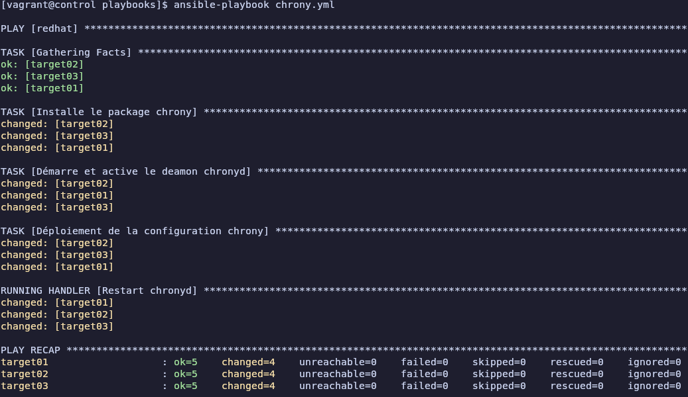
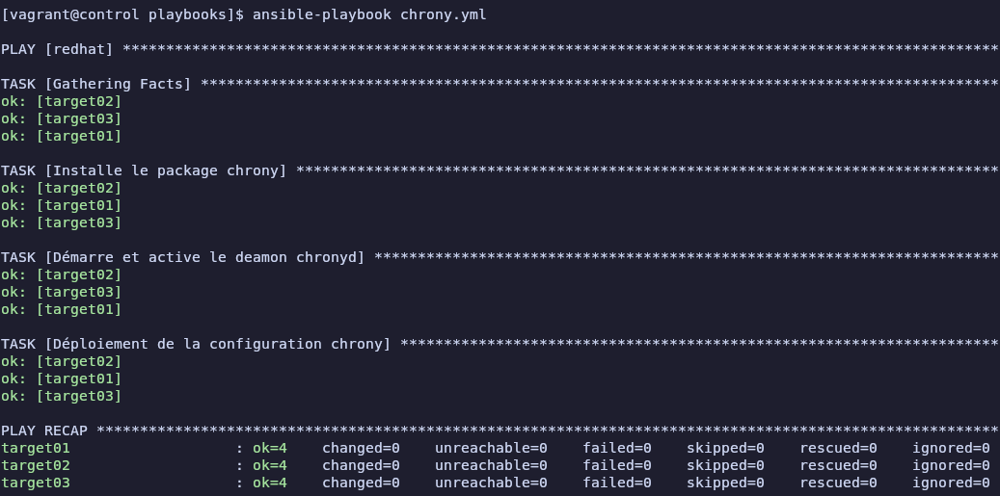

# Atelier 12

## Exercice 1 : 

1. **Démarrer les VMs**  
```bash
cd ~/formation-ansible/atelier-12
vagrant up
```

2. **Connexion au Control Host**
```bash
vagrant ssh control
```

3. **Se rendre dans le repertoire du projet**
```bash
cd ansible/projets/ema/
```

4. **Création d'un playbook `chrony.yml`**
```bash
nano playbooks/chrony.yml
```
```yml
---  # Assure la synchronisation NTP
- hosts: redhat
  become: true
  tasks:
    - name: Installe le package chrony
      dnf:
        name: chrony
        state: present

    - name: Démarre et active le deamon chronyd
      service:
        name: chronyd
        state: started
        enabled: true

    - name: Déploiement de la configuration chrony
      copy:
        dest: /etc/chrony.conf
        mode: '0644'
        content: |
          # /etc/chrony.conf
          server 0.fr.pool.ntp.org iburst
          server 1.fr.pool.ntp.org iburst
          server 2.fr.pool.ntp.org iburst
          server 3.fr.pool.ntp.org iburst
          driftfile /var/lib/chrony/drift
          makestep 1.0 3
          rtcsync
          logdir /var/log/chrony
      notify: Restart chronyd

  handlers:
    - name: Restart chronyd
      service:
        name: chronyd
        state: restarted
```

5. **Vérifier la syntaxe du fichier `chrony.yml`**
```bash
yamllint chrony.yml
```
Aucune sortie, le fichier `chrony.yml` est correct

6. **Exécuter le playbook `chrony.yml`**
```bash
ansible-playbook chrony.yml
```



7. **Vérifier l'idempotence** \
On peut relancer le playbook pour s'assurer qu’aucun changement n’est appliqué si la configuration est déjà en place, si ça indique "ok", c'est que rien n'a changé
```bash
ansible-playbook chrony.yml
```



8. **Vérifier l'état des services** \
On peut aussi verifier l'état des services 
```bash
ansible redhat -a "systemctl status chronyd"

target03 | CHANGED | rc=0 >>
● chronyd.service - NTP client/server
     Loaded: loaded (/usr/lib/systemd/system/chronyd.service; enabled; preset: enabled)
     Active: active (running) since Mon 2025-02-17 10:58:23 UTC; 7min ago
       Docs: man:chronyd(8)
             man:chrony.conf(5)
    Process: 5981 ExecStart=/usr/sbin/chronyd $OPTIONS (code=exited, status=0/SUCCESS)
   Main PID: 5983 (chronyd)
      Tasks: 1 (limit: 5822)
     Memory: 944.0K
        CPU: 49ms
     CGroup: /system.slice/chronyd.service
             └─5983 /usr/sbin/chronyd -F 2

target02 | CHANGED | rc=0 >>
● chronyd.service - NTP client/server
     Loaded: loaded (/usr/lib/systemd/system/chronyd.service; enabled; preset: enabled)
     Active: active (running) since Mon 2025-02-17 10:58:22 UTC; 7min ago
       Docs: man:chronyd(8)
             man:chrony.conf(5)
    Process: 5986 ExecStart=/usr/sbin/chronyd $OPTIONS (code=exited, status=0/SUCCESS)
   Main PID: 5988 (chronyd)
      Tasks: 1 (limit: 5822)
     Memory: 952.0K
        CPU: 47ms
     CGroup: /system.slice/chronyd.service
             └─5988 /usr/sbin/chronyd -F 2

target01 | CHANGED | rc=0 >>
● chronyd.service - NTP client/server
     Loaded: loaded (/usr/lib/systemd/system/chronyd.service; enabled; preset: enabled)
     Active: active (running) since Mon 2025-02-17 10:58:22 UTC; 7min ago
       Docs: man:chronyd(8)
             man:chrony.conf(5)
    Process: 5984 ExecStart=/usr/sbin/chronyd $OPTIONS (code=exited, status=0/SUCCESS)
   Main PID: 5986 (chronyd)
      Tasks: 1 (limit: 5822)
     Memory: 948.0K
        CPU: 48ms
     CGroup: /system.slice/chronyd.service
             └─5986 /usr/sbin/chronyd -F 2
```

9. **Quitter et supprimer**
```bash
exit
vagrant destroy -f
```
