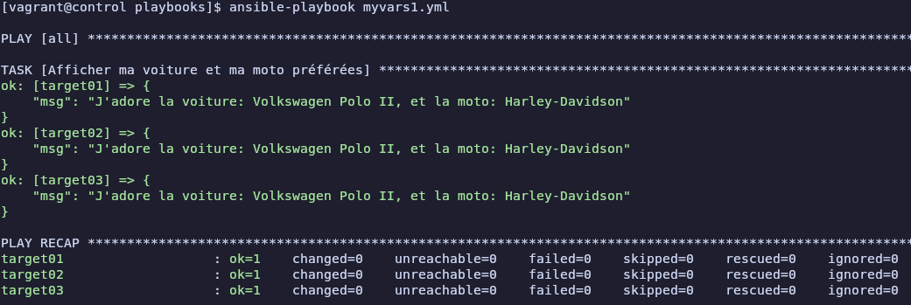
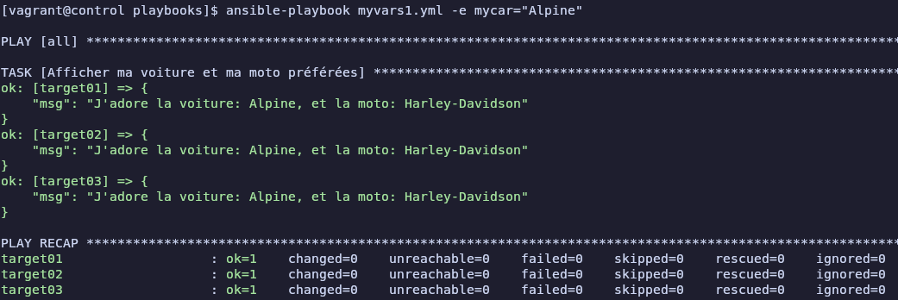
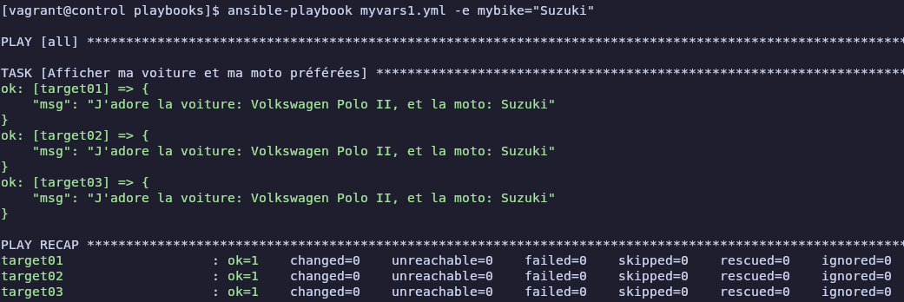
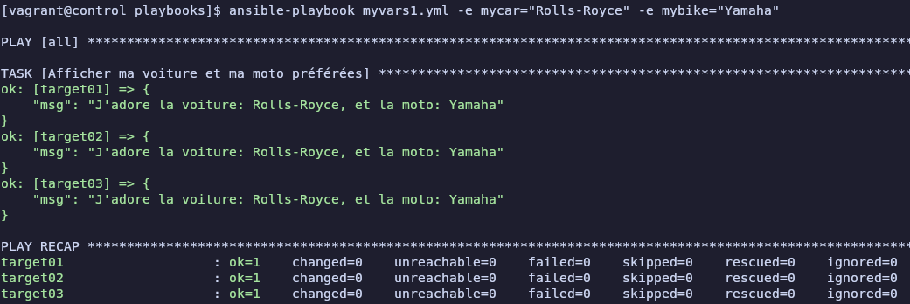
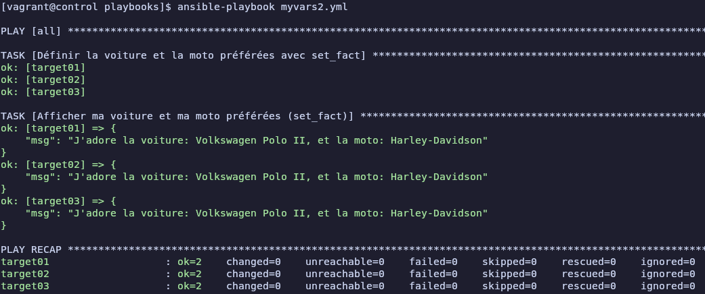
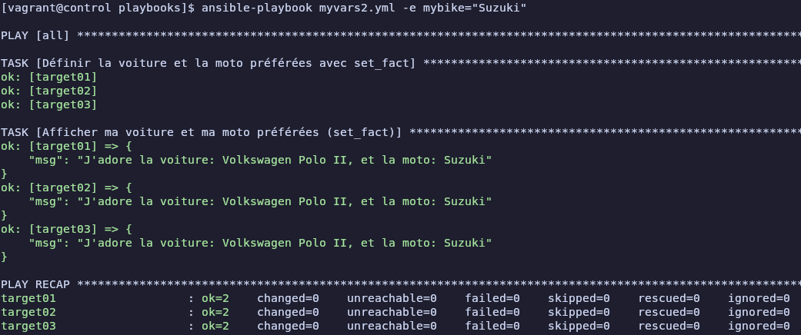
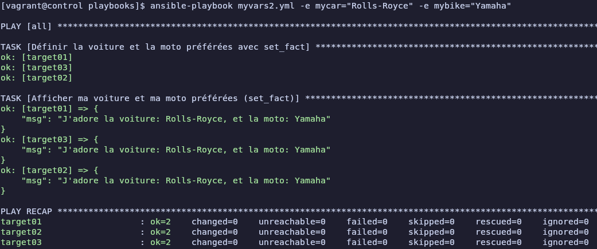
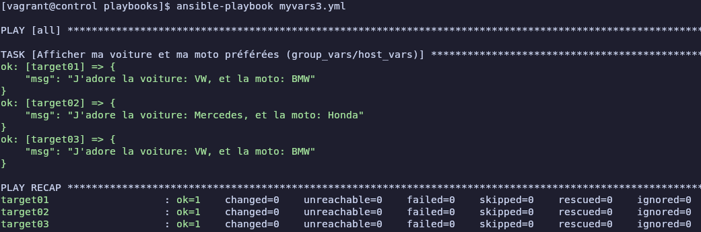
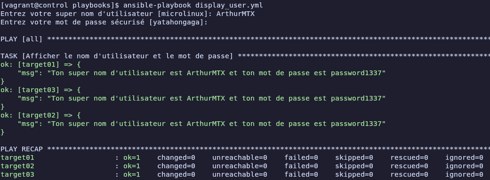
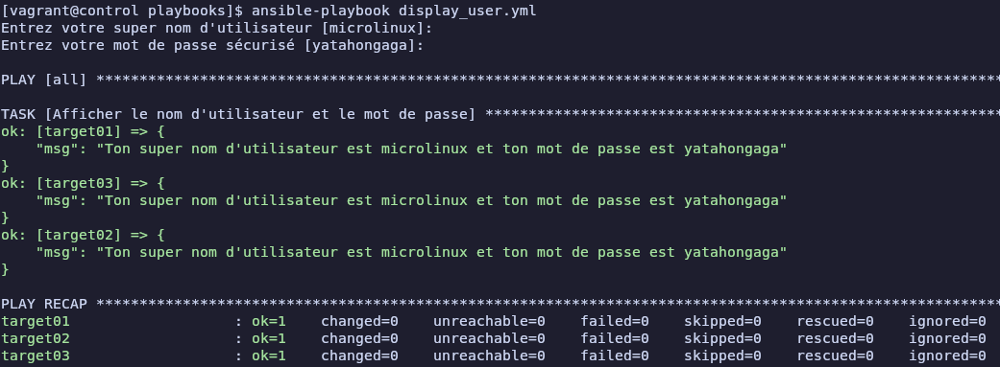

# Atelier 14

## Exercice 1 : 

1. **Démarrer les VMs**  
```bash
cd ~/formation-ansible/atelier-14
vagrant up
```

2. **Connexion au Control Host**
```bash
vagrant ssh control
```

3. **Se rendre dans le repertoire du projet**
```bash
cd ansible/projets/ema/
```

4. **Création d'un playbook (play vars)**
```bash
nano playbooks/myvars1.yml
```
```yml
---
- hosts: all
  gather_facts: false
  vars:
    mycar: "Volkswagen Polo II"
    mybike: "Harley-Davidson"
  tasks:
    - name: Afficher ma voiture et ma moto préférées (play vars)
      debug:
        msg: "J'adore la voiture: {{ mycar }}, et la moto: {{ mybike }}"
```

5. **Vérifier la syntaxe du fichier `myvars1.yml`**
```bash
yamllint myvars1.yml
```
Aucune sortie, le fichier `myvars1.yml` est correct

6. **Exécuter le playbook**
```bash
ansible-playbook myvars1.yml
```


7. **Exécuter le playbook en précisant `mycar`**
```bash
ansible-playbook myvars1.yml -e mycar="Alpine"
```


8. **Exécuter le playbook en précisant `mybike`**
```bash
ansible-playbook myvars1.yml -e mybike="Suzuki"
```


9. **Exécuter le playbook en précisant `mycar` et `mybike`**
```bash
ansible-playbook myvars1.yml -e mycar="Rolls-Royce" -e mybike="Yamaha" 
```


10. **Création d'un playbook (set_fact)**
```bash
nano playbooks/myvars2.yml
```
```yml
---
- hosts: all
  gather_facts: false
  tasks:
    - name: Définir la voiture et la moto préférées avec set_fact
      set_fact:
        mycar: "Volkswagen Polo II"
        mybike: "Harley-Davidson"
    - name: Afficher ma voiture et ma moto préférées (set_fact)
      debug:
        msg: "J'adore la voiture: {{ mycar }}, et la moto: {{ mybike }}"
```

11. **Vérifier la syntaxe du fichier `myvars2.yml`**
```bash
yamllint myvars2.yml
```
Aucune sortie, le fichier `myvars2.yml` est correct

12. **Exécuter le playbook**
```bash
ansible-playbook myvars2.yml
```


13. **Exécuter le playbook en précisant `mycar`**
```bash
ansible-playbook myvars2.yml -e mycar="Alpine"
```


14. **Exécuter le playbook en précisant `mybike`**
```bash
ansible-playbook myvars2.yml -e mybike="Suzuki"
```


15. **Exécuter le playbook en précisant `mycar` et `mybike`**
```bash
ansible-playbook myvars2.yml -e mycar="Rolls-Royce" -e mybike="Yamaha" 
```


16. **Créer un dossier `group_vars` dans la racine du projet**
```bash
mkdir -p group_vars
ls

ansible.cfg  group_vars  inventory  playbooks
```

17. **Créer le fichier `group_vars/all.yml`**
```bash
nano group_vars/all.yml
```
```yml
mycar: "VW"
mybike: "BMW"
```

18. **Créer un dossier `host_vars` dans la racine du projet**
```bash
mkdir -p host_vars
ls

ansible.cfg  group_vars  host_vars  inventory  playbooks
```

19. **Créer le fichier `host_vars/target02.yml`**
```bash
nano host_vars/target02.yml
```
```yml
mycar: "Mercedes"
mybike: "Honda"
```

20. **Création d'un playbook (group_vars/host_vars)**
```bash
nano playbooks/myvars3.yml
```
```yml
---
- hosts: all
  gather_facts: false
  tasks:
    - name: Afficher ma voiture et ma moto préférées (group_vars/host_vars)
      debug:
        msg: "J'adore la voiture: {{ mycar }}, et la moto: {{ mybike }}"
```

21. **Vérifier la syntaxe du fichier `myvars3.yml`**
```bash
yamllint myvars3.yml
```
Aucune sortie, le fichier `myvars3.yml` est correct

22. **Exécuter le playbook**
```bash
ansible-playbook myvars3.yml
```


23. **Création d'un playbook (variables interactives)**
```bash
nano playbooks/display_user.yml
```
```yml
---
- hosts: all
  gather_facts: false
  vars_prompt:
    - name: "user"
      prompt: "Entrez votre super nom d'utilisateur"
      default: "microlinux"
      private: false
    - name: "password"
      prompt: "Entrez votre mot de passe sécurisé"
      default: "yatahongaga"
      private: true
  tasks:
    - name: Afficher le nom d'utilisateur et le mot de passe
      debug:
        msg: "Ton super nom d'utilisateur est {{ user }} et ton mot de passe est {{ password }}"
```

24. **Vérifier la syntaxe du fichier `display_user.yml`**
```bash
yamllint display_user.yml

display_user.yml
  16:81     error    line too long (96 > 80 characters)  (line-length)
```
Mais bon c'est pas grave je crois :)

25. **Exécuter le playbook**
```bash
ansible-playbook display_user.yml
```


Si on ne rentre aucunes valeurs : \


26. **Quitter et supprimer**
```bash
exit
vagrant destroy -f
```