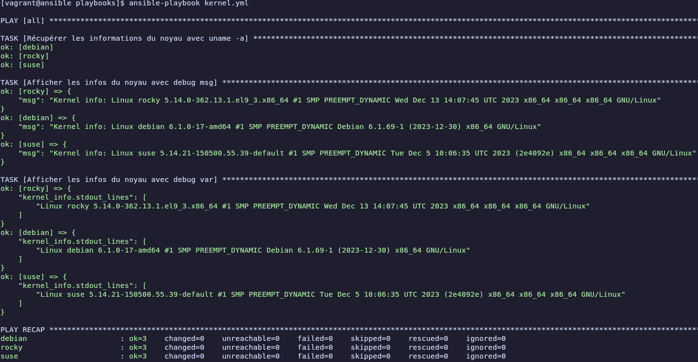
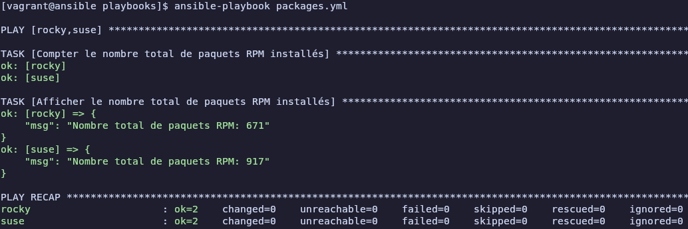

# Atelier 15

## Exercice 1 : 

1. **Démarrer les VMs**  
```bash
cd ~/formation-ansible/atelier-15
vagrant up
```

2. **Connexion au Control Host**
```bash
vagrant ssh ansible
```

3. **Se rendre dans le repertoire du projet**
```bash
cd ansible/projets/ema/playbooks/
```

4. **Création d'un playbook**
```bash
nano kernel.yml
```
```yml
---
- hosts: all
  gather_facts: false
  tasks:
    - name: Récupérer les informations du noyau avec uname -a
      command: uname -a
      register: kernel_info
      changed_when: false

    - name: Afficher les infos du noyau avec debug msg
      debug:
        msg: "Kernel info: {{ kernel_info.stdout }}"

    - name: Afficher les infos du noyau avec debug var
      debug:
        var: kernel_info.stdout_lines
```

5. **Vérifier la syntaxe du fichier `kernel.yml`**
```bash
yamllint kernel.yml
```
Aucune sortie, le fichier `kernel.yml` est correct

6. **Exécuter le playbook**
```bash
ansible-playbook kernel.yml
```


7. **Création d'un playbook**
```bash
nano packages.yml
```
```yml
---
- hosts: rocky,suse
  gather_facts: false
  tasks:
    - name: Compter le nombre total de paquets RPM installés
      shell: "rpm -qa | wc -l"
      register: rpm_count
      changed_when: false

    - name: Afficher le nombre total de paquets RPM installés
      debug:
        msg: "Nombre total de paquets RPM: {{ rpm_count.stdout | trim }}"
```

8. **Vérifier la syntaxe du fichier `packages.yml`**
```bash
yamllint packages.yml
```
Aucune sortie, le fichier `packages.yml` est correct

9. **Exécuter le playbook**
```bash
ansible-playbook packages.yml
```


10. **Quitter et supprimer**
```bash
exit
vagrant destroy -f
```