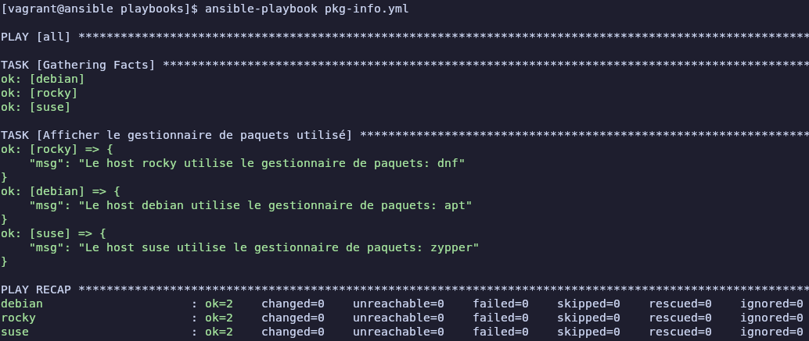
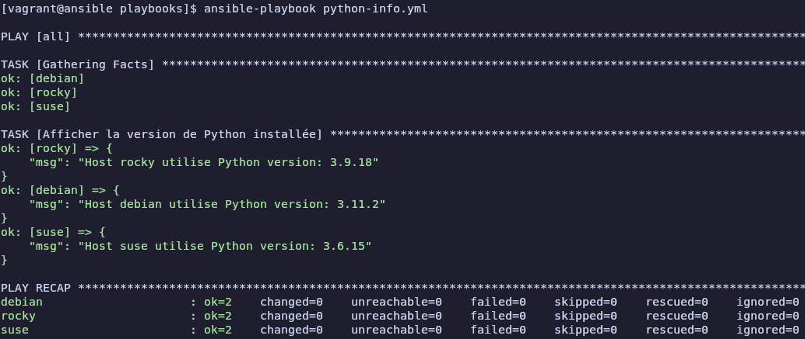
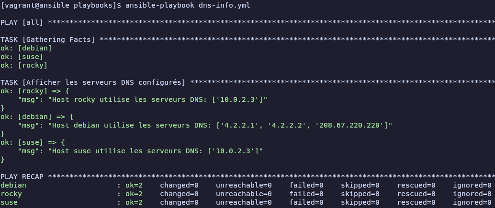

# Atelier 16

## Exercice 1 : 

1. **Démarrer les VMs**  
```bash
cd ~/formation-ansible/atelier-16
vagrant up
```

2. **Connexion au Control Host**
```bash
vagrant ssh ansible
```

3. **Se rendre dans le repertoire du projet**
```bash
cd ansible/projets/ema/playbooks/
```

4. **Création d'un playbook**
```bash
nano pkg-info.yml
```
```yml
---
- hosts: all
  tasks:
    - name: Afficher le gestionnaire de paquets utilisé
      debug:
        msg: "Le host {{ inventory_hostname }} utilise le gestionnaire de paquets: {{ ansible_pkg_mgr }}"
```

5. **Vérifier la syntaxe du fichier `pkg-info.yml`**
```bash
yamllint pkg-info.yml

pkg-info.yml
  6:81      error    line too long (105 > 80 characters)  (line-length)
```
Ce n'est pas très grave

6. **Exécuter le playbook**
```bash
ansible-playbook pkg-info.yml
```


7. **Création d'un playbook**
```bash
nano python-info.yml
```
```yml
---
- hosts: all
  tasks:
    - name: Afficher la version de Python installée
      debug:
        msg: "Host {{ inventory_hostname }} utilise Python version: {{ ansible_python.version.major }}.{{ ansible_python.version.minor }}.{{ ansible_python.version.micro }}"
```

8. **Vérifier la syntaxe du fichier `python-info.yml`**
```bash
yamllint python-info.yml

python-info.yml
  6:81      error    line too long (173 > 80 characters)  (line-length)
```
Ce n'est pas très grave

9. **Exécuter le playbook**
```bash
ansible-playbook python-info.yml
```


10. **Création d'un playbook**
```bash
nano dns-info.yml
```
```yml
---
- hosts: all
  tasks:
    - name: Afficher les serveurs DNS configurés
      debug:
        msg: "Host {{ inventory_hostname }} utilise les serveurs DNS: {{ ansible_dns.nameservers }}"
```

11. **Vérifier la syntaxe du fichier `dns-info.yml`**
```bash
yamllint dns-info.yml

dns-info.yml
  6:81      error    line too long (100 > 80 characters)  (line-length)
```
Ce n'est pas très grave

12. **Exécuter le playbook**
```bash
ansible-playbook dns-info.yml
```


13. **Quitter et supprimer**
```bash
exit
vagrant destroy -f
```