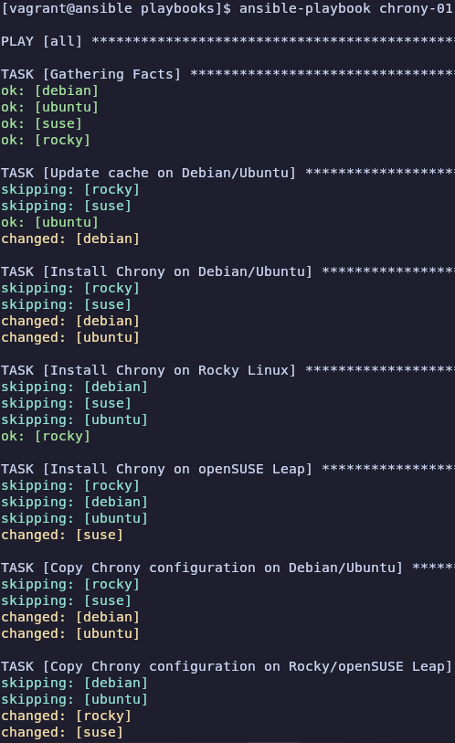
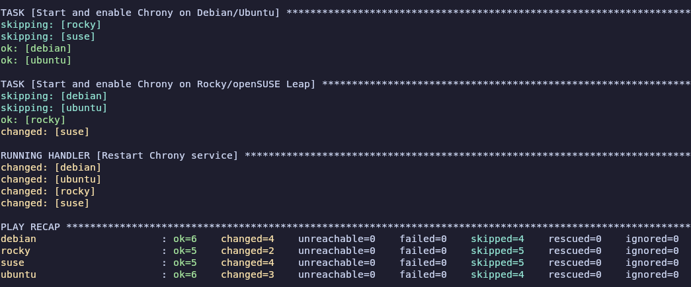
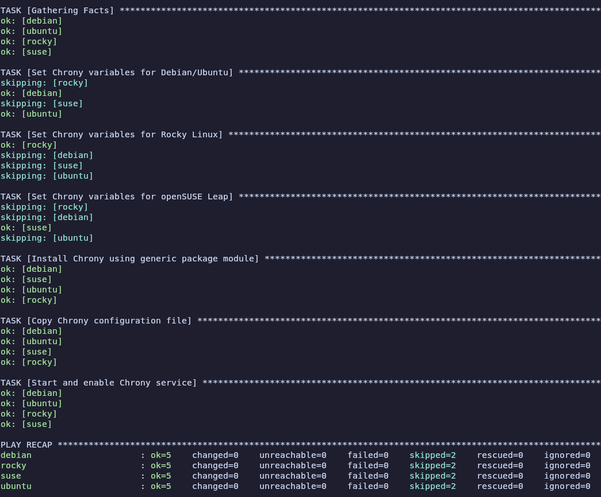

# Atelier 17

## Exercice 1 : 

1. **Démarrer les VMs**  
```bash
cd ~/formation-ansible/atelier-17
vagrant up
```

2. **Connexion au Control Host**
```bash
vagrant ssh ansible
```

3. **Se rendre dans le repertoire du projet**
```bash
cd ansible/projets/ema/playbooks/
```

4. **Création d'un playbook**
```bash
nano chrony-01.yml
```
```yml
---
- hosts: all
  become: true
  tasks:
    - name: Update cache on Debian/Ubuntu
      apt:
        update_cache: true
        cache_valid_time: 3600
      when: ansible_os_family == "Debian"

    - name: Install Chrony on Debian/Ubuntu
      apt:
        name: chrony
        state: present
      when: ansible_os_family == "Debian"

    - name: Install Chrony on Rocky Linux
      dnf:
        name: chrony
        state: present
      when: ansible_distribution == "Rocky"

    - name: Install Chrony on openSUSE Leap
      zypper:
        name: chrony
        state: present
      when: ansible_distribution == "openSUSE Leap"

    - name: Copy Chrony configuration on Debian/Ubuntu
      copy:
        dest: /etc/chrony/chrony.conf
        mode: '0644'
        content: |
          server 0.fr.pool.ntp.org iburst
          server 1.fr.pool.ntp.org iburst
          server 2.fr.pool.ntp.org iburst
          server 3.fr.pool.ntp.org iburst
          driftfile /var/lib/chrony/drift
          makestep 1.0 3
          rtcsync
          logdir /var/log/chrony
      when: ansible_os_family == "Debian"
      notify: Restart Chrony service

    - name: Copy Chrony configuration on Rocky/openSUSE Leap
      copy:
        dest: /etc/chrony.conf
        mode: '0644'
        content: |
          server 0.fr.pool.ntp.org iburst
          server 1.fr.pool.ntp.org iburst
          server 2.fr.pool.ntp.org iburst
          server 3.fr.pool.ntp.org iburst
          driftfile /var/lib/chrony/drift
          makestep 1.0 3
          rtcsync
          logdir /var/log/chrony
      when: ansible_distribution in ["Rocky", "openSUSE Leap"]
      notify: Restart Chrony service

    - name: Start and enable Chrony on Debian/Ubuntu
      service:
        name: chrony
        state: started
        enabled: true
      when: ansible_os_family == "Debian"

    - name: Start and enable Chrony on Rocky/openSUSE Leap
      service:
        name: chronyd
        state: started
        enabled: true
      when: ansible_distribution in ["Rocky", "openSUSE Leap"]

  handlers:
    - name: Restart Chrony service
      service:
        name: "{{ 'chrony' if ansible_os_family == 'Debian' else 'chronyd' }}"
        state: restarted
```

5. **Vérifier la syntaxe du fichier `chrony-01.yml`**
```bash
yamllint chrony-01.yml
```
Aucune sortie, le fichier `chrony-01.yml` est correct

6. **Exécuter le playbook**
```bash
ansible-playbook chrony-01.yml
```



7. **Création d'un playbook**
```bash
nano chrony-02.yml
```
```yml
---
- hosts: all
  become: true
  tasks:
    - name: Set Chrony variables for Debian/Ubuntu
      set_fact:
        chrony_package: chrony
        chrony_service: chrony
        chrony_confdir: /etc/chrony
      when: ansible_os_family == "Debian"

    - name: Set Chrony variables for Rocky Linux
      set_fact:
        chrony_package: chrony
        chrony_service: chronyd
        chrony_confdir: /etc
      when: ansible_distribution == "Rocky"

    - name: Set Chrony variables for openSUSE Leap
      set_fact:
        chrony_package: chrony
        chrony_service: chronyd
        chrony_confdir: /etc
      when: ansible_distribution == "openSUSE Leap"

    - name: Install Chrony using generic package module
      package:
        name: "{{ chrony_package }}"
        state: present

    - name: Copy Chrony configuration file
      copy:
        dest: "{{ chrony_confdir }}/chrony.conf"
        mode: '0644'
        content: |
          server 0.fr.pool.ntp.org iburst
          server 1.fr.pool.ntp.org iburst
          server 2.fr.pool.ntp.org iburst
          server 3.fr.pool.ntp.org iburst
          driftfile /var/lib/chrony/drift
          makestep 1.0 3
          rtcsync
          logdir /var/log/chrony
      notify: Restart Chrony service

    - name: Start and enable Chrony service
      service:
        name: "{{ chrony_service }}"
        state: started
        enabled: true

  handlers:
    - name: Restart Chrony service
      service:
        name: "{{ chrony_service }}"
        state: restarted
```

8. **Vérifier la syntaxe du fichier `chrony-02.yml`**
```bash
yamllint chrony-02.yml
```
Aucune sortie, le fichier `chrony-02.yml` est correct

9. **Exécuter le playbook**
```bash
ansible-playbook chrony-02.yml
```


10. **Quitter et supprimer**
```bash
exit
vagrant destroy -f
```
