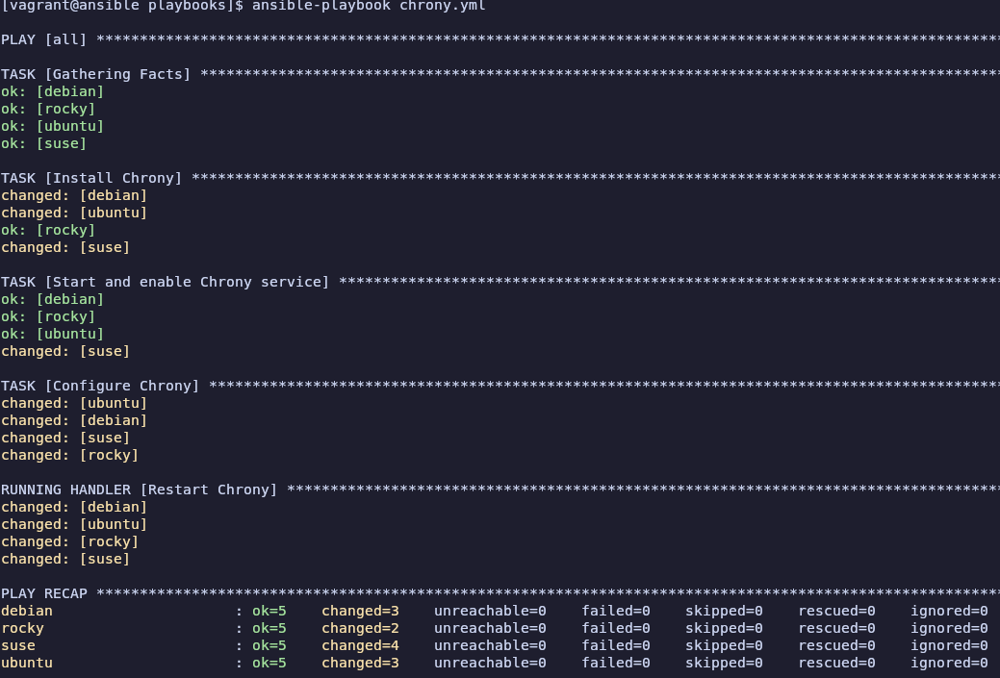
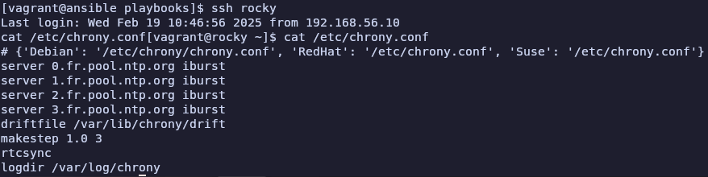

# Atelier 18

## Exercice 1 : 

1. **Démarrer les VMs**  
```bash
cd ~/formation-ansible/atelier-18
vagrant up
```

2. **Connexion au Control Host**
```bash
vagrant ssh ansible
```

3. **Se rendre dans le repertoire du projet**
```bash
cd ansible/projets/ema/playbooks/
```

4. **Création d'un template**
```bash
nano templates/chrony.conf.j2
```
```jinja
{# templates/chrony.conf.j2 #}
# {{ chrony_conf_path }}
server 0.fr.pool.ntp.org iburst
server 1.fr.pool.ntp.org iburst
server 2.fr.pool.ntp.org iburst
server 3.fr.pool.ntp.org iburst
driftfile /var/lib/chrony/drift
makestep 1.0 3
rtcsync
logdir /var/log/chrony
```

5. **Création d'un fichier variables**
```bash
nano vars/chrony_vars.yml
```
```yml
---
chrony_package:
  Debian: chrony
  RedHat: chrony
  Suse: chrony

chrony_service:
  Debian: chrony
  RedHat: chronyd
  Suse: chronyd

chrony_conf_path:
  Debian: /etc/chrony/chrony.conf
  RedHat: /etc/chrony.conf
  Suse: /etc/chrony.conf
```

6. **Création d'un playbook**
```bash
nano chrony.yml
```
```yml
---
- hosts: all
  become: true
  vars_files:
    - vars/chrony_vars.yml
  tasks:
    - name: Install Chrony
      package:
        name: "{{ chrony_package[ansible_os_family] }}"
        state: present

    - name: Start and enable Chrony service
      service:
        name: "{{ chrony_service[ansible_os_family] }}"
        state: started
        enabled: true

    - name: Configure Chrony
      template:
        src: templates/chrony.conf.j2
        dest: "{{ chrony_conf_path[ansible_os_family] }}"
      notify: Restart Chrony

  handlers:
    - name: Restart Chrony
      service:
        name: "{{ chrony_service[ansible_os_family] }}"
        state: restarted
```

7. **Vérifier la syntaxe du fichier `chrony.yml`**
```bash
yamllint chrony.yml
```
Bon pas grave comme dhab tsais

8. **Exécuter le playbook**
```bash
ansible-playbook chrony.yml
```


9. **Vérifier la configuration**
```bash
ssh rocky
cat /etc/chrony.conf
```


10. **Quitter et supprimer**
```bash
exit
exit
vagrant destroy -f
```